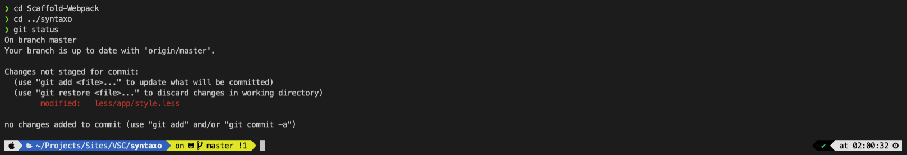
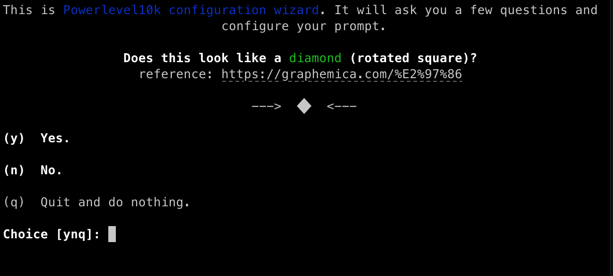
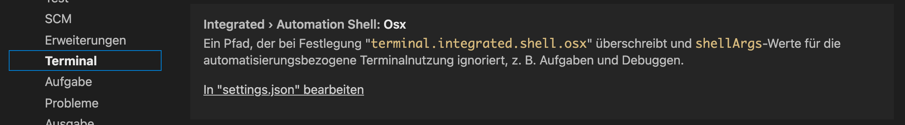

# Style your Shell



# Instructions

Download iTerm2

https://iterm2.com/

## Shell

Install oh my zsh

https://ohmyz.sh/

```shell
sh -c "$(curl -fsSL https://raw.githubusercontent.com/ohmyzsh/ohmyzsh/master/tools/install.sh)"
```

### Plugins

Install plugins and add to ~/.zshrc

https://github.com/ohmyzsh/ohmyzsh/tree/master/plugins

```shell
$ nano ~/.zshrc
// or
$ vi ~/.zshrc
```

```
plugins=(
git
vscode
...add more...
)
```

## Fonts

Donwload recommended fonts and install with double click.

Follow this link info:

https://github.com/romkatv/powerlevel10k#meslo-nerd-font-patched-for-powerlevel10k

Or download the fonts directly here:

[https://github.com/romkatv/powerlevel10k-media/raw/master/MesloLGS%20NF%20Regular.ttf](MesloLGS NF Regular.ttf)
[https://github.com/romkatv/powerlevel10k-media/raw/master/MesloLGS%20NF%20Bold.ttf](MesloLGS NF Bold.ttf)
[https://github.com/romkatv/powerlevel10k-media/raw/master/MesloLGS%20NF%20Italic.ttf](MesloLGS NF Italic.ttf)
[https://github.com/romkatv/powerlevel10k-media/raw/master/MesloLGS%20NF%20Bold%20Italic.ttf](MesloLGS NF Bold Italic.ttf)

## Theme

https://github.com/romkatv/powerlevel10k

```bash
$ git clone --depth=1 https://github.com/romkatv/powerlevel10k.git ~/powerlevel10k
$ echo 'source ~/powerlevel10k/powerlevel10k.zsh-theme' >>~/.zshrc
```

Now is the time to configure

```bash
p10k configure
```



Follow the steps and set everything as you want. That's it.

# Integrate in VSC

Open settings in VSC (Visual Studio Code)

Go to Terminal/Console, scroll down to settings.json and click on it



Add following lines on top

```json
  "terminal.integrated.fontFamily": "MesloLGS NF",
  "terminal.integrated.shell.osx": "/bin/zsh",
```
